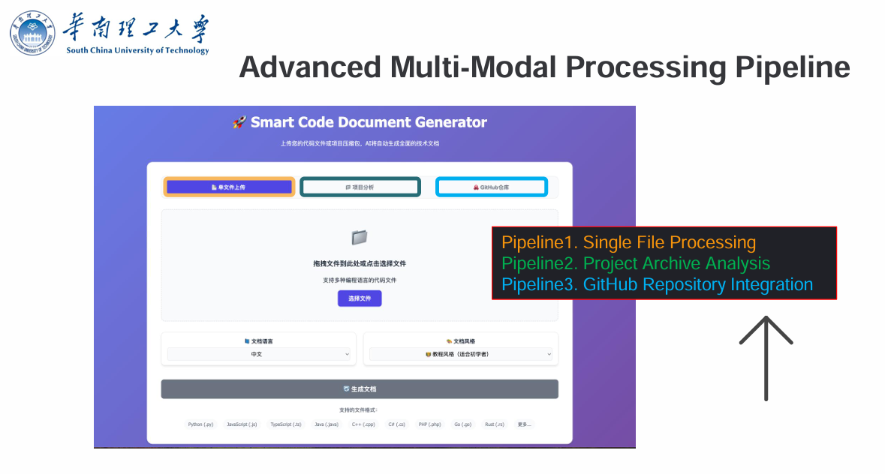
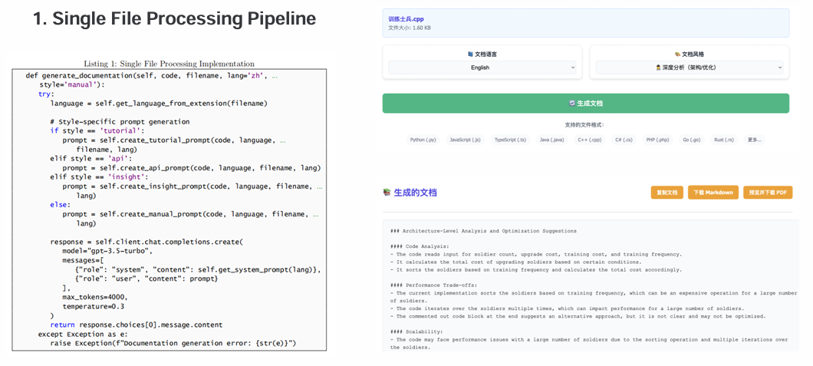
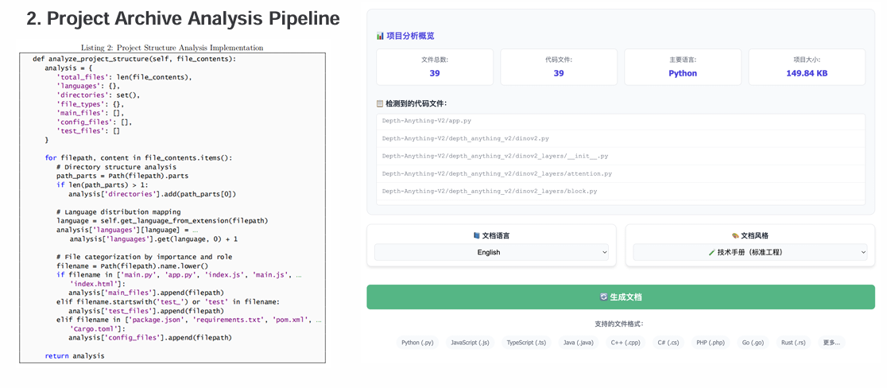
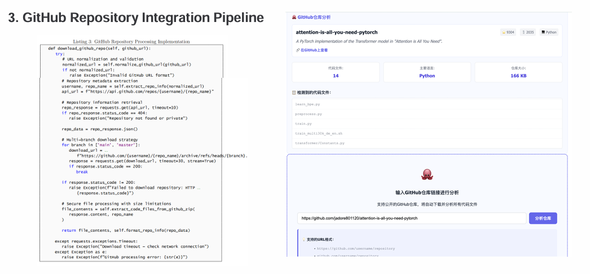

# 🧠 智能代码文档生成器 Smart Code Doc Generator

基于 **OpenAI GPT API** 的智能文档系统，支持多种编程语言的代码上传，自动识别函数、类、架构，生成专业、多语言、多风格技术文档，可导出为 Markdown / PDF。

---

## 🚀 功能亮点

* **📘 支持中英文切换**（界面与输出文档语言）
* **🎨 多种文档风格**（教程 / 手册 / API / 注释风格 / 架构分析）
* **🖋 编辑 & 复制文档**，即时预览 Markdown
* **⬇️ 一键导出 Markdown / PDF 文件**
* **🌐 支持语言识别**：Python, JavaScript, Java, C++, Go, 等主流语言

---

## 🛠️ 快速开始

### 环境要求

* Python >= 3.8
* OpenAI API 密钥
* 前端依赖：HTML + JavaScript（无需打包）

### 安装依赖

```bash
pip install -r requirements.txt
```

### 启动服务

```bash
python app.py
# 访问: http://localhost:9001
```
## Screenshots

### 1) Figuer1


### 2) Figure2


### 3) Figure3


### 4) Figure4


---

## 🧪 使用指南

1. 上传任意支持语言的 `.py`, `.js`, `.java` 等代码文件
2. 选择生成的语言（中文 / English）
3. 选择文档风格：

   * 🧑‍🏫 教程风格（适合初学者）
   * 🧪 技术手册（标准工程）
   * 📜 API 文档（接口导向）
   * 🗣️ 注释风格（简洁说明）
   * 🕵️ 深度分析（架构/优化）
4. 点击【🔄 生成文档】，稍等片刻
5. 编辑生成文档 → 可预览 → 可导出为 `.md` / `.pdf`

---

## 📤 示例请求结构（前端）

```json
{
  "filename": "example.py",
  "content": "<code_string>",
  "lang": "zh",  // 或 "en"
  "style": "manual"  // tutorial, api, comment, insight
}
```

## 📄 示例响应结构

```json
{
  "success": true,
  "documentation": "# 📋 代码文档\n\n## 📖 概述 ..."
}
```

---

## 📂 目录结构说明

```
├── app.py                     # Flask 入口文件
├── generator/
│   └── documentation.py      # 文档生成器核心逻辑
├── templates/
│   └── index.html            # 前端页面结构
├── static/
│   ├── css/style.css         # 页面样式
│   └── js/main.js            # 所有 JS 交互逻辑
└── requirements.txt          # Python依赖
```

---

## 🧾 PDF 导出说明

我们使用 `markdown-it` 渲染 markdown，然后通过 `html2pdf.js` 转换为 A4 纸张的 PDF：

* 样式采用 GitHub Markdown 风格 + Noto Sans 字体
* 导出整洁、边距规范、适配中文/英文内容
* 自动以原文件名导出为 `xxx-docs.pdf`

---

## 🔐 安全建议

* OpenAI API Key 建议配置于环境变量
* 文件大小默认 < 5MB，UTF-8 编码
* 前端不存储任何密钥

---

## 📈 可拓展方向（已在规划）

* 支持 `.zip` 多文件上传打包生成
* 输出 Word / HTML 格式
* 支持行级注释对比（Diff-style）
* AI文档质量打分与提示
* 登录用户历史存档与版本控制

---

## 📄 License

MIT License.

本项目由 FutureX 智能文档小组维护开发。
